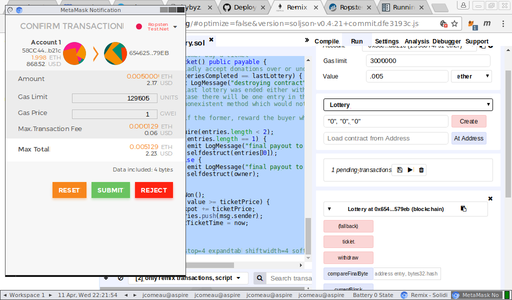

# Synopsis

This is a simple lottery which runs on the Ethereum network. Your address is
your bid. You get paid if and only if someone else makes a bid after, but not
more than 256 blocks after, your bid was mined, *and* the block hash ends with
the same byte that your address does.

# Testing
- `make setup` to create private blockchain and 2 test accounts
- `make jclottery.test` to create the contract and drop you into the console.
   Once you are at the `>` prompt, you can:
 + `buyTickets(3)` to make 3 attempts to win the lottery
 + `buyTickets(0)` to keep buying until one ticket wins
 + `buyTickets(-1)` to keep buying until all lotteries specified by the
   contract have finished and it has selfdestructed.

# Deploying
By [rafaelosirs](https://github.com/ethereum/mist/issues/3646#issuecomment-363683548):
- Install [Metamask](https://metamask.io/) plugin for your browser
- Navigate to [https://remix.ethereum.org/](https://remix.ethereum.org)
- Click on settings and choose your compiler.
  Note that optimization is unchecked by default.
- Login to Metamask and choose your network. It is a good idea to first use the
  Ropsten network for testing, and using the Buy button to get ETH from a free
  faucet.
- Go back to the Compile tab, delete the contents of the example contract, and
  paste in your own. Some versions of chrome are buggy and will not accept
  large pastes, so you may need to break it up into chunks.
- Click on the Run tab. If your contract requires input data you need to
  "double quote" it. Click on Create.
- Metamask will open. Choose your gas price and Submit. Open Metamask again,
  click the transaction hash.
- Once published, in etherscan go to the contract address and click the Contract
  Code tab. Verify and Publish.
- Set the name of the contract to the exact same name as in remix. Compile 
  to the same version as in remix and set optimization to "No" if you didn't 
  click it on remix in step 3.
- You should now have a published contract, with source code on etherscan.

# Interacting (remix.ethereum.org)
- Buy a ticket under the Run tab, by entering the value in ether and clicking
  the pink `ticket` button.
- Click any of the blue buttons to view the values, such as `totalEntries`.

# Interacting (etherscan.io)
- View variables under the `Read Smart Contract` tab. This currently does not
  let you interact with the `payable` attributes such as `ticket`. See for
  example our [deployment on Ropsten](https://ropsten.etherscan.io/address/0x6546254aeb308e9acc83d4d5eb4eb7329e1579eb#readContract)
